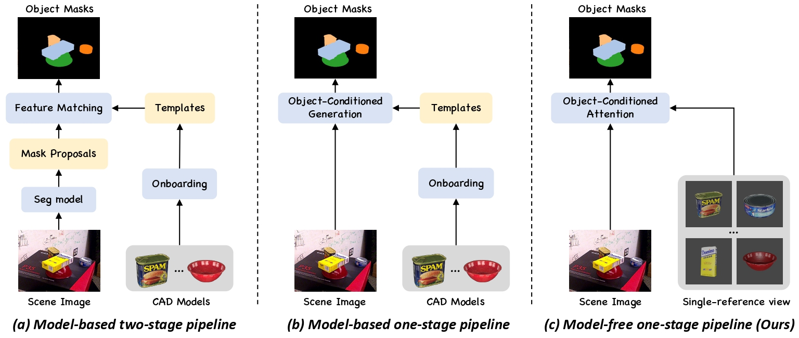
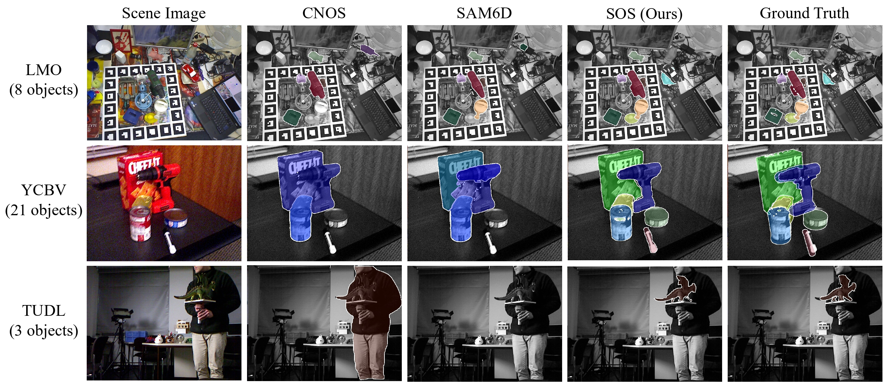

<div align="center">

<h1>SOS!: A Streamlined Object-Conditional Transformer for Model-free Segmentation</h1>

<p>
  <a href="https://arxiv.org/pdf/2608.15295"></a>
  <a href="https://sos-seg.github.io/"></a>
</p>

<p>
  <a href="mailto:jiaqi.hu@tum.de">Jiaqi Hu<sup>1,2</sup></a> ·
  <a href="mailto:junwen.huang@tum.de">Junwen Huang<sup>1,3</sup></a> ·
  <a href="mailto:hongli.xu@tum.de">Hongli Xu<sup>1</sup></a> ·
  <a href="mailto:peterkty@gmail.com">Peter KT Yu<sup>4</sup></a> ·
  <a href="mailto:nassir.navab@tum.de">Nassir Navab<sup>1,3</sup></a> ·
  <a href="mailto:b.busam@tum.de">Benjamin Busam<sup>1,3</sup></a> ·
  <a href="mailto:slobodan.ilic@tum.de">Slobodan Ilic<sup>1,2</sup></a>
</p>

<p>
  <sup>1</sup> Technical University of Munich, Munich, Germany<br>
  <sup>2</sup> Siemens AG, Munich, Germany<br>
  <sup>3</sup> Munich Center for Machine Learning, Munich, Germany<br>
  <sup>4</sup> ROBOX
</p>

<p>Official implementation of the <strong>SOS</strong> paper, accepted at <strong>BMVC 2026</strong>.</p>

</div>

## Overview

Foundation segmentation models generate strong class-agnostic masks but struggle
to associate them with specific target objects. SOS addresses this gap without
requiring 3D models. Given one reference image per object, SOS uses its
Object-Conditional Transformer to unify target identification and mask
generation in a single feed-forward pass, enabling accurate and efficient
unseen-object segmentation.



_Comparison of model-based segmentation pipelines with our model-free,
one-stage SOS pipeline._

## Installation

Create and activate the `SOS` environment:

```bash
conda create -n SOS python=3.10 pip -y
conda activate SOS
```

Install PyTorch, the project dependencies, and the bundled BOP toolkit:

```bash
python -m pip install torch==2.7.1 torchvision==0.22.1 \
  --index-url https://download.pytorch.org/whl/cu118
python -m pip install -r requirements.txt
python -m pip install -e ./bop_toolkit
```

## Data preparation

### Checkpoint

Download the pretrained SOS checkpoint from
[Google Drive](https://drive.google.com/file/d/11BSwpNgMLitTz6vJmW_NbMNmcRSpDlKq/view?usp=sharing),
create the checkpoint directory if needed, and place the downloaded file at:

```text
ckpt/SOS_model.ckpt
```

This is the default checkpoint path in `config/infer_config.yaml`.

### Dataset

Download the benchmark datasets from the
[BOP dataset page](https://bop.felk.cvut.cz/datasets/) and arrange them using
the directory structure below.

For benchmark inference, set `dataset_name` to one of `ycbv`, `lmo`, `hb`, or
`tudl`, then update that dataset's `data_root`. The loader expects this layout:

```text
<data_root>/
└── <dataset>/
    └── test/
        └── <scene_id>/
            ├── rgb/
            ├── mask_visib/
            └── scene_gt.json
```

### Reference template

Benchmark inference uses exactly one template image and one mask per object. Set
`condition_dir` to the template root (the repository default is `templates`)
and place each object directory directly under its dataset directory:

```text
<condition_dir>/
└── <dataset>/
    └── obj_XXXXXX/
        ├── rgb_0.png
        └── mask_0.png
```

## Benchmark inference

Benchmark paths and model options—including the checkpoint, dataset,
thresholds, and output settings—are configured in `config/infer_config.yaml`.
After editing the configuration, run:

```bash
conda activate SOS
python inference.py
```

With the default settings, predictions are written to
`output/SOS_lmo-test.json` in BOP COCO result format. In general, the output
filename is `output/<method_name>_<dataset_name>-test.json`.

Set `vis_mask_enable: true` to save qualitative results under
`output/<dataset_name>_infer_vis/`. Reference-image DINO features are computed
once per benchmark run, and the temporary on-disk cache is removed when the run
finishes.

### Crop-based refinement

Run the optional second-pass refinement pipeline with the same configuration:

```bash
python inference_refine.py
```

Its crop margin and minimum instance area are controlled by the `refinement`
section of `config/infer_config.yaml`. It writes to the same result file as
standard inference, so move or rename any existing result first if you want to
keep both outputs.

### Custom images

`inference_custom.py` is a minimal single-image example. Before running it,
edit `data_base`, `scene_name`, and `obj_name` in the script. It expects:

```text
<data_base>/
├── test_scene/<scene_name>.jpg
└── obj_condition/<obj_name>.png
```

The condition PNG should show the object against a background that allows
`get_mask` to extract its foreground mask. Results are saved in `output/demo/`.

## Evaluation



_Qualitative comparison with CNOS and SAM6D on the LMO, YCBV, and TUDL
benchmarks._

The evaluator expects a BOP-style result filename and dataset annotations that
include `scene_gt_coco.json`. Evaluate the default LMO output with:

```bash
python scripts/eval.py \
  --result_filenames SOS_lmo-test.json \
  --results_path output \
  --datasets_path /path/to/bop-datasets
```

If the COCO ground-truth files are missing, generate them first:

```bash
python scripts/calc_gt_coco.py \
  --dataset lmo \
  --dataset_split test \
  --datasets_path /path/to/bop-datasets
```

Use `python scripts/eval.py --help` and
`python scripts/calc_gt_coco.py --help` for all options.

## Training

First, download the training data released with
[FoundationPose](https://drive.google.com/drive/folders/1s4pB6p4ApfWMiMjmTXOFco8dHbNXikp-).

The GSO and Objaverse paths and training options are configured in
`config/train_config.yaml`. Update the configuration, then run:

```bash
python train.py
```

The default configuration uses GPUs `0` and `1` with mixed precision and DDP.
Checkpoints are saved to `ckpt/<MMDD_HHMMSS>/` every 10,000 steps. Weights &
Biases logging is controlled by `wandb_enable` near the top of `train.py`; set
it to `False` for a run without W&B logging.

## Acknowledgements

This project builds upon [DINOv3](https://github.com/facebookresearch/dinov3)
for visual feature extraction and uses the
[BOP Toolkit](https://github.com/thodan/bop_toolkit) for benchmark data handling
and evaluation. We use the training data released with
[FoundationPose](https://github.com/NVlabs/FoundationPose). We thank their
authors for making these projects and resources publicly available.

## Citation

If you find SOS useful in your research, please cite our BMVC 2026 paper:

```bibtex
@inproceedings{hu2026sos,
  title     = {{SOS!}: A Streamlined Object-Conditional Transformer for Model-free Segmentation},
  author    = {Hu, Jiaqi and Huang, Junwen and Xu, Hongli and Yu, Peter KT and
               Navab, Nassir and Busam, Benjamin and Ilic, Slobodan},
  booktitle = {Proceedings of the British Machine Vision Conference (BMVC)},
  year      = {2026}
}
```
